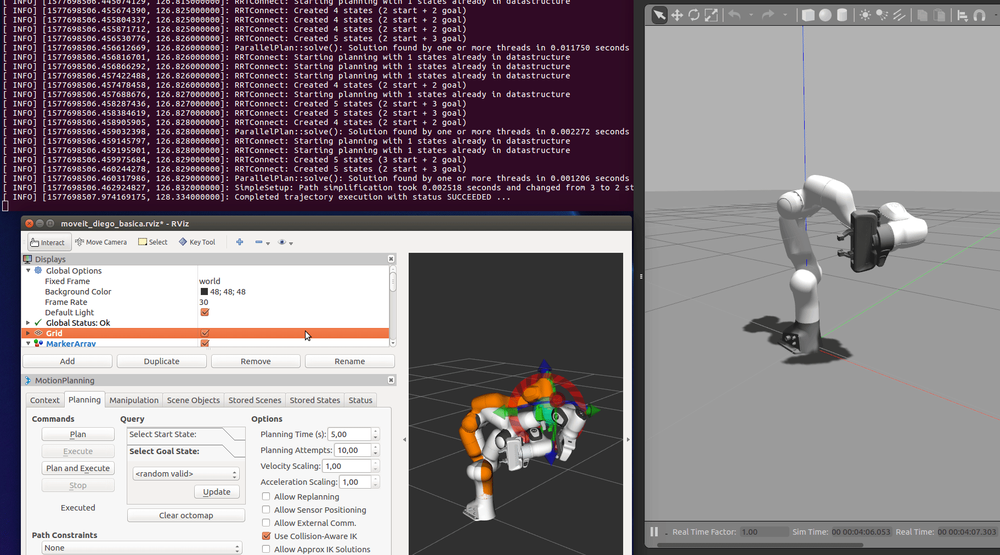

# panda_diego



Code to show the basic usage of the moveitcommander API in python. The Gazebo simulation of the Panda arm is taken from [this repo](https://github.com/erdalpekel/panda_simulation).
___

## Usage

#### Sourcing the repo

```
source robindustrial_ws/devel/setup.bash
```

#### Gazebo simulation of the basic Panda + Moveit config + Rviz plugin  

```
roslaunch panda_diego simulation_diego.launch
```
#### Basic python program to interface moveit_commander API

```
rosrun panda_diego test.py 
```

## TO DO List

* Separate text.py in different examples


